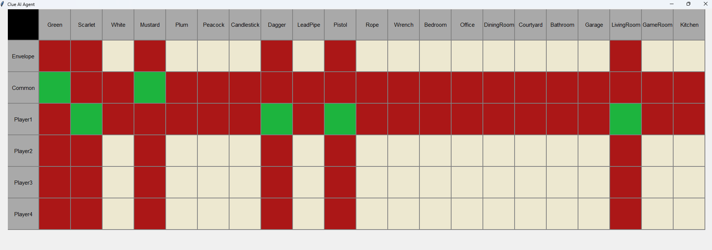

# 🧩Cluedo AI Agent

A Python-based AI assistant for the board game **Clue (Cluedo)**.  

This project uses **SAT logic** via [PySAT](https://pysathq.github.io/) to deduce which cards are held by each player and the envelope, while providing a simple **real-time GUI interface** and suggesting optimal guesses using a heuristic scoring model based on expected information gain as derived from the current state of the game.


## ℹ️ Overview

This project was inspired by my family, who are all avid board game players and **VERY** competitive. In my computer engineering and AI classes, I was learning about binary logic and deduction, and I realized I could implement this to destroy my family in one of our favorite games.


## 🔍 Technical Details

**PART 1: SAT Logic Solver**

This project works by treating all information in Clue as Conjunctive Normal Form (CNF) boolean expressions. By creating a boolean symbol for each combination of *(player, card)*, we can treat both the rules of the game, basic logic, and game information all in this framework. 

For example, if we want to encode that a card can be in exactly one place and one place only, we can use the boolean expression

(∀i, j ∈ {1,…,n}, i != j: -X(pi, c) OR -X(pj, c) ) AND (X(p1, c) OR X(p2, c) OR ... X(pi, c))

Where c is the card and p is a player (or envelope). Similarly, we can encode any turn with the following (general) logic: 

-X(b, c1) AND -X(b, c2) AND -X(b, c3), ∀b ∈ {players g -> r exclusive}

AND

X(r, c1) OR X(r, c2) OR X(r, c3)

Where {c1, c2, c3} are the guess (person, weapon, location), g is the guessing player, and r is the responding player. 

If you are the guesser, you get to see the card the player responds with, and therefore that second clause can be swapped simply with

X(r, cs)

Where cs is the card shown.

There are other similar constraints that must be put on this problem, such as that the envelope must have exactly one person, weapon, and location as well as the fact that players may only have up to n cards (excluding the envelope and common cards). I will not show the exact logic for these for the sake of repetitiveness, but they follow similar logical patterns.

All of this logic is then combined into one massive CNF statement, which we refer to as the knowledge base (KB). Then, we use logical entailment to determine if a given symbol must be true or false. If KB ⊨ X, then X must be true. If KB ⊨ -X, then X must be false. If neither is entailed, then it is still unknown. This calculation is repeated for all 21 * (n + 2) symbols where n is the number of players. Finally, it is converted to a matrix to be displayed on the GUI using tkinter.

**PART 2: Best Guess Modeling**

In order to determine the best guess for our AI agent to use, we first need two things: the current state of logic in the game (from **Part 1**), and the rooms available for the player to go to (**Inputted from console**).  In order to calculate the best guess, we can use a heuristic scoring method rather than a Monte Carlo method since the number of possibilities is relatively small (<1000). Furthermore, we limit ourselves by which rooms we can visit, we also limit ourselves to only guessing for information that is **NOT** known to be with another player, in order to maximize information gain. Once we have our valid people, weapons, and locations, we generate a list of candidate guesses by just putting together every possible combination. From there, we will submit each to a heuristic that will score them.

Right now in the heuristic, we judge a guess based on how much information it is expected to provide *on average*. We also weight changes to the Envelope significantly higher than any other change since at the end of the day, that *is* the end goal. So, to accomplish this, we first must generate all possible outcomes that a guess could give. Then, we can simply calculate the EV of the guess with the formula: 
 
**EV** = **∑** P(outcome) * S(outcome)

Where S(x) is the scoring function. In this heuristic, we naively assume that every outcome is equally likely, therefore:

P(outcome) = 1/#outcomes

Finally we define our scoring function S(x) as such:

Change in any square of a player -> 1 point
Change to RED in any Envelope square -> 4 points
Change to GREEN in any Envelope square -> 12 points

These values are not necessarily optimized, however the heuristic performs well in practice game I have done. If anyone would like to contribute and help me make a better heuristic, please do! This one was at least good enough to beat my family and so I am satisfied!

### ✍️ Authors

My name is [Alexander Wiegand](https://github.com/alexw1230) and I am a sophomore Computer Engineering and AMS student at Stony Brook Honors College. My interests include machine learning, finance, robotics, mathematics, and more.


## 🚀 Usage

To run the program:

```bash
python main.py 4
```

Where 4 here is the number of players. This number may be 2-6.

**Sample Guess**

```text
Command (Guess / Has / Not / Get / Get_Not): guess
Enter the player number who guessed: 2
Enter the person: Plum
Enter the weapon: Wrench
Enter the location: Courtyard
Enter the player number who responded (0 if no one): 4
```

**Sample Get Guesses**

```text
Command (Guess / Has / Not / Get / Get_Not): get
Enter valid locations: LivingRoom Kitchen Garage
Guess Option 1: Plum, Wrench, Kitchen | Score=5.636363636363636 | Delta=0.0
Guess Option 2: Plum, Wrench, Garage | Score=5.636363636363636 | Delta=0.0
Guess Option 3: Plum, Rope, Kitchen | Score=5.333333333333334 | Delta=0.3030303030303019
Guess Option 4: Plum, Rope, Garage | Score=5.333333333333334 | Delta=0.3030303030303019
Guess Option 5: Plum, LeadPipe, Kitchen | Score=5.333333333333334 | Delta=0.3030303030303019
Guess Option 6: Plum, LeadPipe, Garage | Score=5.333333333333334 | Delta=0.3030303030303019
Guess Option 7: Plum, Candlestick, Kitchen | Score=5.333333333333334 | Delta=0.3030303030303019
Guess Option 8: Plum, Candlestick, Garage | Score=5.333333333333334 | Delta=0.3030303030303019
Guess Option 9: White, Wrench, Kitchen | Score=5.333333333333334 | Delta=0.3030303030303019
Guess Option 10: White, Wrench, Garage | Score=5.333333333333334 | Delta=0.3030303030303019
===================
Final Guess: Plum, Wrench, Kitchen
===================
```

**Example Display Output**



**Note:** These examples are not necessarily related to one another but rather just an example of how it is generally used

**All Commands Explained**

Guess: Enter a guess

Has: Enter a player specifically has a card (Not usually used in a game)

Not: Enter a player specifically does not have a card (Not usually used in a game)

Get: Gets the top guesses based on a list of *possible* locations

Get_Not: Gets the top guesses based on a list of which locations are *impossible*

## ⬇️ Installation

Requires [PySAT](https://pysathq.github.io/)

```bash
pip install python-sat
```
OR
```bash
pip install -r requirements.txt
```

**Must be on a Windows system**

## 💭 Contributing

This project is mostly complete however if anyone would like to work on the heuristic function you are more than welcome to!